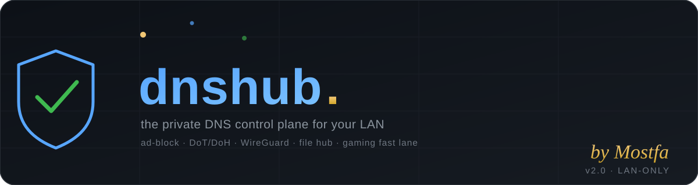

<p align="center">
  
</p>

<h1 align="center">dnshub — the private DNS control plane for your LAN</h1>

<p align="center">
  <b>One file turns a small home server into your own private DNS hub:</b><br>
  ad-blocking for every device · encrypted DNS (DoT/DoH with your own CA) ·
  WireGuard access · a file hub · a web control panel — with a single on/off switch.
</p>

<p align="center">
  
  
  
  
  
  
</p>

> **dnshub = DNS + hub.** It answers DNS for every device on your LAN, blocks
> ads at the resolver (no extension needed, works on phones, TVs and consoles),
> keeps your DNS invisible to your ISP, and gives you a web panel to manage the
> whole box — **while staying 100% internal**: no domain, no cloud, no
> telemetry, no plaintext DNS anywhere on the path.

---

## Contents

- [Why](#why)
- [Features](#features)
- [How it fits together](#how-it-fits-together)
- [Hardware](#hardware)
- [Quick start](#quick-start)
- [Everyday commands](#everyday-commands)
- [Web UIs & ports](#web-uis--ports)
- [Turning your devices onto it](#turning-your-devices-onto-it)
- [The security model](#the-security-model)
- [The internal `.home` zone](#the-internal-home-zone)
- [Gaming fast lane](#gaming-fast-lane)
- [Testing](#testing)
- [Project layout](#project-layout)
- [Roadmap](#roadmap)
- [Security](#security)
- [License & credits](#license--credits)

---

## Why

Most home setups either forward DNS to an ISP resolver (visible, filterable,
slow) or run a Pi-hole (great, but the box becomes a single point that is hard
to operate from your phone and hard to turn off safely).

dnshub is built for one person who owns their network:

- **Privacy by construction** — every log on the wire is either encrypted
  (DoT/DoH device→box, DoT/DoH box→Internet) or internal-only (UDP 53 on your
  LAN, the `.home` zone).
- **Boring, debuggable internals** — one master script, and every service is
  a plain systemd unit you can `systemctl cat`. No docker stack, no compose
  file, no k8s.
- **One switch** — `dnshub off` gracefully stops the whole hub and restores
  everything exactly as it was; `dnshub on` brings it all back.
- **Engineered for a metered connection** — the blocklist refresh is a single
  transaction per day by default; the resolver caches aggressively and only
  prefetches what the family actually uses.

---

## Features

| | |
|---|---|
| 🛡️ **Ad-blocking** | 3M+ domains compiled into a memory-mapped binary blob (DHB2). Subdomain matching, dual-tier cache (RAM + SQLite), hot-entry prefetch. |
| 🔐 **Encrypted DNS** | Local **DoT :853** and **DoH :443** fronting the resolver, signed by a **CA you generate and own** (installed once per device). |
| 🌐 **Encrypted upstreams** | The resolver itself only talks DoT/DoH (Cloudflare, Google) — *no plaintext egress, verified*. |
| 🏠 **Internal `.home` zone** | `dns.home`, `panel.home`, `files.home`, `wg.home`, `router.home`… plus reverse (PTR) records, served outright — zero data cost, works even if the outside world is down. Unknown `.home` names answer NXDOMAIN, they never leak. |
| 🎮 **Gaming fast lane** | Game-platform domains (Riot, Epic, Steam, Xbox, PlayStation, EA, Battle.net…) are pinned in RAM and prefetched — game DNS is answered locally at RAM speed. |
| 🖥️ **Web control panel** (:8081) | Per-service on/off/restart, live logs, blocklist stats, resolver metrics, trends and a doctor. Token-protected. |
| 📁 **File hub** (:8082) | Browse/upload/download files on the box from any device. Token-protected, path-traversal proved against. |
| 📊 **Resolver dashboard** (:8080) | Cache hit %, latency, per-type breakdown, recent queries, gaming-mode toggle. |
| 🧅 **WireGuard** | Split-tunnel VPN (peer `/32` + LAN `/24`) with an **always-on safety guard**: if the LAN ever routes into the tunnel again, the guard tears it down and disables it instead of letting it brick the network. |
| 🔀 **Master switch** | `on` / `off` / `restart` driven by a single ordered list; ssh deliberately survives `off`. |
| 🚓 **Abuse protection** | fail2ban jail fed by an in-resolver abusive-queries tracker; abused IPs get dropped at nftables level. |
| 🕐 **Clock sanity** | chrony keeps the clock right — DNSSEC-validated answers refuse to work on a wrong clock. |

Everything runs on the **Python standard library** (plus `dnspython` — the one
third-party module, used by the resolver), so there is no dependency hell: no
node, no pip stacks, no containers required for the core.

---

## How it fits together

```
        devices on your LAN (phones, TVs, consoles, PCs)
                 │  plain DNS :53   OR   DoT :853 / DoH :443 (your CA)
                 ▼
        ┌──────────────────────────────────────┐
        │  dnshub-resolver  (dns-server.py)     │  ←─ 3,041,276-domain blocklist
        │  · ad-block first, then cache (RAM+DB)│     memory-mapped DHB2 blob
        │  · internal .home zone, served local  │
        │  · gaming fast lane pinned in RAM     │
        └──────────────┬───────────────────────┘
                       │ upstream: DoT / DoH ONLY (Cloudflare, Google)
                       ▼
                    Internet   ←  nothing plaintext ever leaves the box
```

A second path: `dnshub-privacy` (DoT/DoH) is a thin TLS front that forwards
every query to `127.0.0.1:53` — *it has no other upstream at all*, so
"encrypted all the way" is guaranteed by construction.

```
master switch:  src/dnshub  (on|off|restart|status|logs|doctor|…)
     │
     ├── systemd units:  dnshub-resolver · dnshub-control · dnshub-files ·
     │                   dnshub-privacy · dnshub-blocklist  (+fail2ban, chrony, wg)
     ├── container:      dnshub-unbound (opt-in recursive cache)
     └── safety:         dnshub-wg-guard.service  (always on; no-op when wg0 is down)
```

---

## Hardware

A quiet little box is enough. The reference host:

| | |
|---|---|
| RAM | **1.36–1.8 GiB** (the whole hub: resolver+panel+files+privacy ≈ 75 MiB RSS; the rest is OS) |
| CPU | **2 cores** |
| OS | Debian/Ubuntu (systemd, AppArmor-friendly; wg-quick/chrony/fail2ban/docker for the optional parts) |
| Network | static LAN IP (the cert SANs follow it) |

`dns-server.py` streams the blocklist (≈63 MB) through a memory map and keeps
the cache LRU-bounded, so memory stays flat at 3M domains.

---

## Quick start

> Assume the box is Debian/Ubuntu, has `python3`, and your user can `sudo`.
> The master file lives in `src/` and is designed to be *the* file you pull.

```sh
# 1. copy the project to your server
scp -r src dev@your-box:/home/dev/dnshub

# 2. install (one-time): units, control token, sudo allowlist, CA + server certs
cd /home/dev/dnshub
sudo ./dnshub install

# 3. start everything
sudo ./dnshub on

# 4. grab the panel token
sudo ./dnshub token
```

Then open `http://<your-box-ip>:8081` and paste the token. Done.

What `install` does, exactly:

- installs `dnshub-ctl` (the only sudo-allowlisted helper) and the four Python
  services, the blocklist unit and the **WireGuard safety guard**,
- writes the control token (`/etc/dnshub/control.token`, root:dnshub 0640),
- generates the **own CA + server certificate** (SANs: `dns.home`, `panel.home`,
  `files.home`, `wg.home`, `127.0.0.1`, your LAN IP, the VPN IP `10.8.0.1`),
- validates the sudoers drop-in with `visudo -c` before installing it.

If your box is not at `192.168.1.12`, set `DNSHUB_LAN_IP` (it feeds the cert
SANs and the internal zone), e.g. `DNSHUB_LAN_IP=10.0.0.5 sudo ./dnshub on`.

---

## Everyday commands

```sh
sudo ./dnshub on          # start / restart the whole hub (safe order)
sudo ./dnshub off         # stop everything; ssh survives; restores with `on`
sudo ./dnshub restart     # off then on
sudo ./dnshub status      # one screen: units, memory, blocklist, leak check
sudo ./dnshub logs        # tail resolver logs (logs <service> for another)
sudo ./dnshub dns <name>  # resolve through dnshub, show blocked or not
sudo ./dnshub doctor      # diagnose + suggest fixes
sudo ./dnshub token       # print the panel token
sudo ./dnshub blocklist refresh|stats|sources|test <domain>
sudo ./dnshub selftest    # offline resolver invariants
sudo ./dnshub version     # print version & author
```

---

## Web UIs & ports

| Port | Service | What it is | Auth |
|---|---|---|---|
| **53** UDP/TCP | resolver | plain DNS for your LAN devices | — |
| **853** | DoT | DNS-over-TLS (Android "Private DNS") | your CA |
| **443** | DoH | DNS-over-HTTPS `GET/POST /dns-query` + `GET /ca.pem` | your CA |
| **8080** | dashboard | resolver stats, recent queries, gaming mode | — |
| **8081** | control panel | per-service on/off/restart, logs, blocklist, trends, doctor | bearer token |
| **8082** | file hub | browse/upload/download files on the box | bearer token |
| **51820** UDP | WireGuard | VPN into the LAN | key pair |

---

## Turning your devices onto it

**DNS (plain)** — set the device's DNS server to the box IP.

**Android — Private DNS (encrypted)**: Settings → Network → Private DNS →
hostname `dns.home` (on-LAN) or `10.8.0.1` (over your VPN). Install the CA once
from `https://<box-ip>/ca.pem`.

**Windows 11 — DoH**: Network → DNS → enable "DNS over HTTPS" with
`https://192.168.1.12/dns-query`, CA imported into *Trusted Root*.

**iOS / macOS**: install the CA profile, add a DNS-over-TLS profile with
hostname `dns.home`.

**kdig / dig / stubby**:

```sh
kdig @dns.home -d google.com
curl --cacert /etc/dnshub/certs/ca.crt \
     -H 'Accept: application/dns-message' \
     --data-binary @q.bin https://dns.home/dns-query
```

---

## The security model

- **Panel auth**: a 256-bit random bearer token, compared with
  `hmac.compare_digest` (constant time), **rate-limited: 8 failures → 300 s
  lockout** per client IP. The token also gates the file hub.
- **Least privilege**: the web UI may only invoke `dnshub-ctl`, a root-owned
  allowlist helper that refuses any unit/action outside its table. The panel
  process itself runs as the operator, not root.
- **Private DNS certs**: generated locally, never leave the box. The CA is
  served to your devices only; the server key is group-readable by the
  `dnshub` group and readable by no one else.
- **No plaintext egress**: upstream hooks are DoT/DoH; the privacy front
  forwards only to `127.0.0.1:53`. Verified in CI-style acceptance scripts.
- **Abuse**: abusive query patterns feed fail2ban → nftables ban.
- **Traversal-proof file hub**: realpath containment, token-only, 4 GiB cap.

---

## The internal `.home` zone

`dns.home`, `panel.home`, `files.home`, `resolver.home`, `privacy.home`,
`wg.home` (→ `10.8.0.1`), `router.home` (→ your gateway), `mtt-server`,
plus PTR records for the LAN IP and the VPN peers. Served **before** the
blocklist and **never** forwarded upstream — the box's own names work even
while upstreams are down, and a typoed `.home` name answers NXDOMAIN without
the ISP ever seeing it.

---

## Gaming fast lane

Game-platform domains (`riotgames.com`, `leagueoflegends.com`,
`epicgames.com`, `forever`, `steampowered.com`, `xboxlive.com`,
`playstation.net`, `ea.com`, `battle.net`, `ubisoft.com`,
`rockstargames.com`, `discord.com` …) are marked **sticky**: they never leave
RAM, always qualify for prefetch, and are served at RAM speed with honest TTLs
(clamped 5 s–1 h).

---

## Testing

Everything was verified live against the reference box before shipping:

```sh
sudo ./dnshub selftest            # resolver invariants
python3 tests/test_blocklist_parser.py   # 63/63 streaming parser cases
python3 tests/test_blocklist_match.py    # 8/8 matcher + safety-on-mismatch
python3 tests/test_blocklist.py          # DHB2 build → load → match → dedupe
```

Plus acceptance harnesses for: master-switch `off`/`on` safety, DoT/DoH with
the generated CA, the internal zone over UDP/TCP/DoT, blocked-domain checks,
and guard reaction tests.

---

## Project layout

```
src/
  dnshub                      ← the master: install/on/off/status/logs/doctor/…
  dns-server.py               ← the resolver (:53, :8080) + blocklist + cache
  dnshub-privacy.py           ← DoT :853 / DoH :443 front (:443, /ca.pem)
  dnshub-control.py           ← control panel :8081 (token-protected)
  dnshub-files.py             ← file hub :8082 (token-protected)
  dnshub-ctl                  ← the sudo-allowlisted helper the panel calls
  dnshub-wg-guard             ← WireGuard LAN-safety guard (always-on unit)
  dnshub-wg-guard.service
  blocklist-updater.py        ← daily list compile (service-owned schedule)
  blocklist_parser.py         ← streaming, memory-bounded parser
  blocklist_sources.py        ← curated source list + categories
  dnshub_blocklist.py         ← DHB2 blob compiler (magic, index, mmap-ready)
tests/                        ← offline unit tests (stdlib only)
assets/                       ← banner
```

---

## Roadmap

- [x] Master switch + control panel + logs
- [x] Ad-block at the resolver (3M+ domains, dual-tier cache)
- [x] Local DoT/DoH with own CA
- [x] Internal `.home` zone + PTR
- [x] Gaming fast lane
- [x] File hub
- [x] WireGuard + LAN-safety guard
- [ ] Per-schedule blocklist profiles per family device
- [ ] Optional: reverse-proxy DoH with client certificate

---

## Security

Found a bug or a hole? Open a draft, or ping `Mostfa` — fixes land fast, and
security-relevant patches are free of charge. See [SECURITY.md](SECURITY.md)
for the threat model.

---

## License & credits

MIT © 2026 **Mostfa** — built privately, in Egypt, for people who like owning
their network. See [LICENSE](LICENSE).

---

<div dir="rtl">

## نبذة بالعربي

**dnshub** — محور تحكم خاص لخادم البيت: بيحجب الإعلانات لكل أجهزة الشبكة (من الريسولفر نفسه، من غير أي إضافة)،
بيشفّر الـ DNS بالكامل (DoT/DoH بشهادة بتولّدها بنفسك)، بيوفر VPN خاص (WireGuard) وملفات ولوحة تحكم.
من البداية للنهاية **بدون إنترنت خارجي زائد، بدون نطاق، بدون تتبع** — وكله بالأمر الواحد `dnshub on` / `dnshub off`.

العنوان: من إعداد **مصطفى**.

</div>